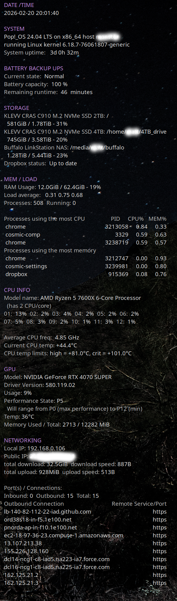
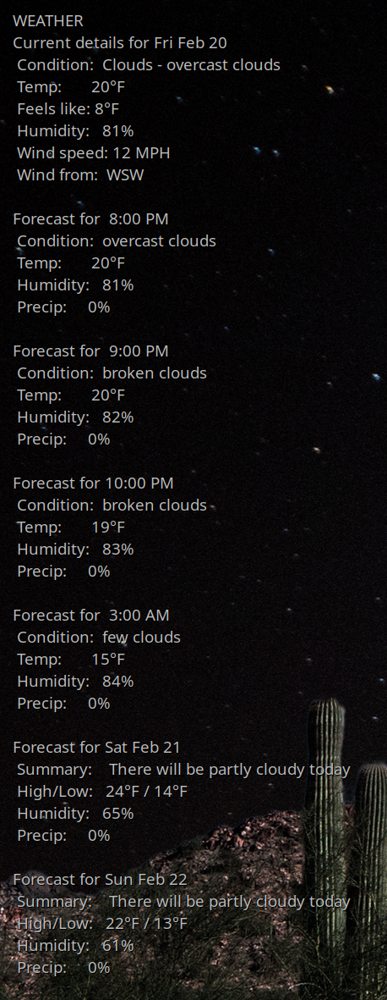

# conky-mh

**Conky** is a free, light-weight system monitor for X, that displays any kind of information on your desktop. It can also run on Wayland (with caveats), macOS, output to your console, a file, or even HTTP. 

Learn more in the [Conky git repository](https://github.com/brndnmtthws/conky), which has a useful wiki that you probably want to read through.

**conky-mh** is nothing more than my personal Conky configuration. I've taken ideas from dozens of others over the many years I've used Conky, but what you see here is otherwise my work, especially the Bash scripts used to get information.

I left a couple of sample temp files in the `data_files` directory so you can see what the scripts create.

- `gpu_info.txt` is created by `get_gpu_info.sh` where it is also explained.
- `openweathermap.json` is a sample of what is returned by the API call in `get_weather_report.sh`. See [OpenWeather One Call API 3.0](https://openweathermap.org/api/one-call-3) to learn about their API and parse the details of my simple query.

I run this by placing these files in `~/conky` on my Linux machine. I am currently running it on [Pop_OS! 24.04](https://system76.com/pop/) which uses [Wayland](https://wayland.freedesktop.org/).

Before you use this, read through the code carefully. There are many things you will need to adjust. Here are the ones I remember right now as I'm writing this:

- The battery backup UPS section uses `pwrstat`, which I've only tested with my [Cyberpower UPS](https://www.cyberpowersystems.com/). I don't know if it's currently offered software, but it still works great for me. I've replaced the battery inside the UPS as the original aged out, otherwise it's been great for many years. Anyway, if you don't have the same setup, this section will probably need editing or removing.
- In the Storage section, I list four devices. Adjust for yours. I'm certain your main drive will be different and you may not have a secondary drive or a [Buffalo Linkstation NAS](https://buffaloamericas.com/products/category/network-attached-storage/Network-Attached-Storage-for-Home) or use [Dropbox](https://buffaloamericas.com/products/category/network-attached-storage/Network-Attached-Storage-for-Home). Edit accordingly.
- In the CPU section, unless you have the exact same CPU, you will need to make edits. There are probably too many or too few CPUs being polled, etc.
- Unless you have an NVIDIA GPU, that section won't work for you and it may not work on all of their hardware, depending on age and what driver version you have.
- Your network hardware names like `enp12s0` and `wlp170s0` will likely be different. Your machine may not have both wireless and wired connections. You get to explore and learn and adjust the settings.
- You will need your own API key to use [Open Weather Map](https://openweathermap.org/) and will have to look up your latitude and longitude.

I'm probably forgetting something, but you get the idea. This is custom to one of my machines. Feel free to customize it for yours.

Okay, a couple of edited screenshots. First, here's what `conky_main` looks like on my machine.

And here's `conky_weather`.

## License

This program is free software; you can redistribute it and/or modify it under the terms of the [MIT License](LICENSE.txt).

I don't know if you can copyright configuration files and I don't really feel the need. However, I did write the scripts and the slightly more complex ones have copyright notices. I sincerely don't care if or how you use them or any of this code. Have fun!

## Contributions

This repository is just a place for me to share what I use. I'm not currently accepting contributions.

